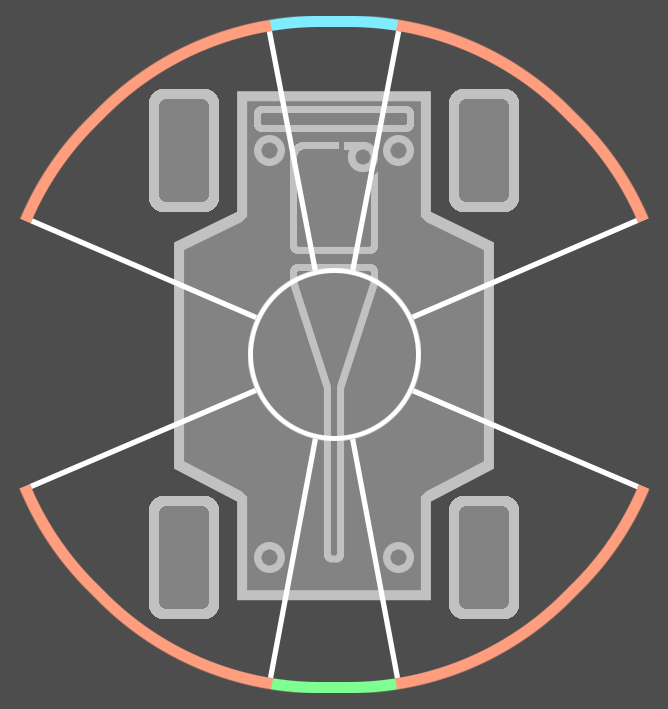
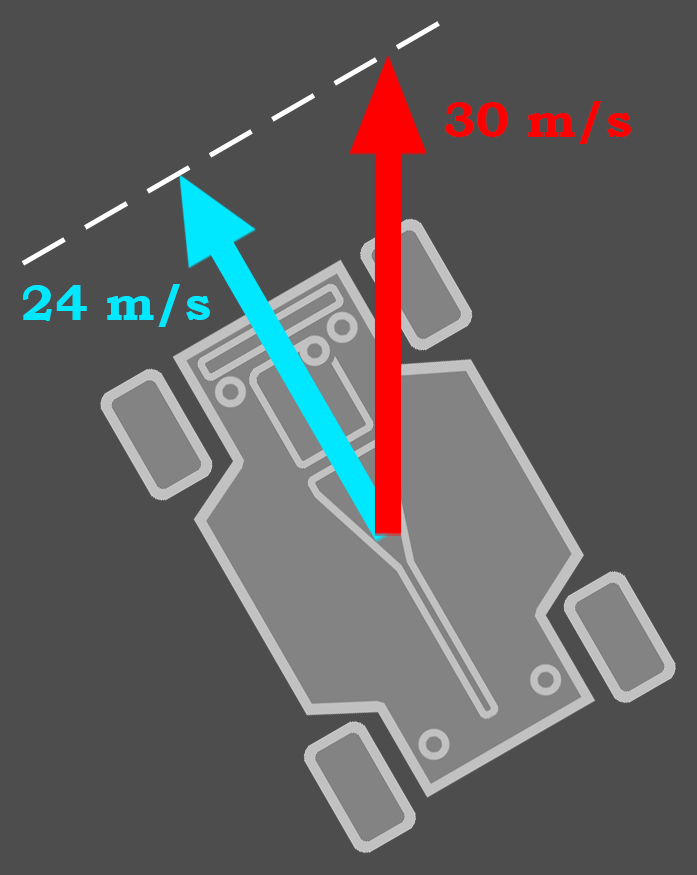
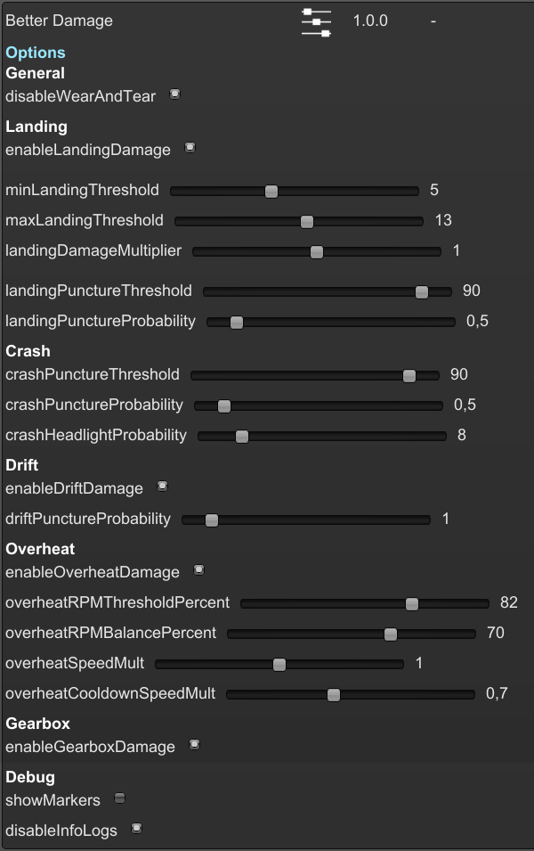

# Better Damage

A mod for Art of Rally that changes how cars take damage to be more fun.

#### Launcher Support

#### Platform Support

## Mechanics

This mod introduces 5 new events which can damage the car parts as well as modify the crash event (original damage event).

Here is a list of the events and the affected car parts :

- **Crash** - suspensions, car body, radiator and gearbox.
- **Landing** - suspensions and tires.
- **Overheat** - engine and turbo.
- **Drifting** - tires.
- **Shifting gear** - gearbox.

### Crash

A crash is triggered when the car hits an obstacle with a strength of at least the minimum defined by the game (original code). The part targeted by the damage depends on the angle at which the car has been hit.

- the frontal zone of the circle (in light blue) will damage the radiator.
- the side zones of the circle (in light red) will damage the suspensions.
- the back zone of the circle (in light green) will damage the gearbox.

Regardless of the angle, the body of the car will take damages.

If the car is hit in one of the front suspensions zones, the suspensions will have a *tilt* in the direction of the collision. This *tilt* is re-adjusted at each collision depending on the collision position and magnitude.

### Landing

A landing is triggered when the car does a jump with a landing strength of at least **minLandingThreshold**.\
The suspensions will be damaged depending on the landing strength. If the landing strength is above **landingPunctureThreshold**, a random tire has a chance to puncture defined by **landingPunctureProbability**.

Landing damages on the suspensions do not increase the *tilt* value, but the *tilt* effect applied on the handling depends on the condition of the suspensions.

### Overheat

When the RPM of the engine goes above **overheatRPMThresholdPercent** the engine starts overheating. After 2 seconds of continuous overheating, the engine starts taking damage.\
When the RPM of the engine is under the **overheatRPMThresholdPercent**, the engine start cooling down. It reaches it's maximum cooling speed when the RPM is under **overheatRPMBalancePercent**.\
When the RPM is between **overheatRPMThresholdPercent** and **overheatRPMBalancePercent** the cooling speed of the engine is proportional to the it's position between the two :

- RPM ~ **overheatRPMThresholdPercent** => cooling speed ~ 0
- RPM ~ **overheatRPMBalancePercent** => cooling speed ~ max

Three factors can affect the efficiency of engine cooling :

- The **condition of the radiator**.
	- Engine cooling efficiency will go down with the condition of the radiator.
- The **country** in which the stage is taking place.
	- **Cooler** countries (Finland, Norway, etc...) will pull the *balance threshold* up, providing faster cooling.
	- **Hotter** countries (Kenya, Indonesia, etc...) will lower the *balance threshold*, providing slower cooling.
- The **weather** of the current stage
	- **Morning / Sunset** will not change the temperature of the stage.
	- **Afternoon** will raise the stage temperature.
	- **Night / Fog** will lower the stage temperature.
	- **Rain** will lower the stage temperature.
	- **Snow** will lower the stage temperature the most.

If the car is equiped with a turbo, it is also affected by the overheating status of the engine.

A turbo will take damage proportional to the RPM of the engine when overheating. Having the RPM close to the max RPM of the engine will damage the turbo more.

If the turbo receives sufficient air while driving, the damage can be mitigated.

The *amount of air* received by the turbo is measured by the movement speed of the car (represented by the red arrow) projected to the direction the car is facing (represented by the blue arrow).

If the RPM is close to the **overheatRPMThresholdPercent**, the car will need at least **30 km/h** (8 m/s) for the turbo to not be damaged.\
If the RPM is close to the *max RPM* of the engine, the car will need at least **100 km/h** (28 m/s) for the turbo to not be damaged.

### Drifting

The car is considerd to be drifting when the lateral slip of a wheel is above a certain threshold. When a wheel has drifted for more than 20 seconds, the tire can puncture depending on **driftPunctureProbability**.

Calculations of drifting state and drifting durations are wheel specific.

### Shifting gear

When shifting gears, the gearbox can take damages in two situations :

- If you shift to a higher gear while throttling and the RPM of the engine is lower than the RPM at which the automatic transmission would shift down. This strains the engine and it will take damage.
- If you shift to a lower gear and the engine RPM increases close to it's max. This forces the gearbox to absorb the excess speed of the engine and it takes damage.

#### Balancing

This section will go into special rules used to balance the damage experience.

- The "wear and tear" game mechanic can be disabled. This mechanic would damage the car at the end of a stage to account for the strain put on the car during the race (engine, radiator, turbo and gearbox).
- Switching to and from neutral and reverse gears are ignored for damages dealt when shifting gears.
- When shifting up, the damage in case of RPM too low is only inflicted if the player is trying to throttle. Shifting to higher gears while stopped will not damage the gearbox (due to auto-clutch).
- Upon landing, a tire cannot be punctured if another tire is already punctured.
- During a drift, if a tire is punctured, that same tire cannot be punctured again for 5 minutes.
- The timers for drifting and ovearheating are reset when restarting or changing stages.

## Usage

Press Ctrl + F10 to open the mod manager menu.\
Adjust toggles and settings in each sections to select what damages you want to activate and how you want them to behave.

By default, the mod doesn't change the behaviour of the game.

### Support

The game does not support car damage in Freeroam mode.\
All other game modes should be supported by this mod.

### General

- **disableWearAndTear** : will disable the damage applied to multiple car parts at the end of a stage (I recommend this to make the damages more fair).\
- **wearAndTearBody** : will re-enable wear and tear for the car body only (necessitates **disableWearAndTear** to be toggled on).

### Landing

- **enableLandingDamage** : will enable damages on the car when it lands from a jump. This will display all other settings in this category.

- **minLandingThreshold** : is the minimum landing force to consider damages to the car.
- **maxLandingThreshold** : is the maximum landing force to consider damages to the car.
- **landingDamageMultiplier** : is a multiplier for damages dealt by jump landings.
- **landingPunctureThreshold** : is the landing strength percent threshold above which a tire can be punctured upon landing (default 90%).
- **landingPunctureProbability** : is the probability percent that a tire will puncture upon landing if the landing strength is over the threshold (default 0.5%).

### Crash

- **crashPunctureThreshold** : is the crash strength percent threshold above which a tire can be punctures upon crashing.
- **crashPunctureProbability** : is the probability percent that a tire will puncture upon crashing if the crash strength is over the threshold (default 0.5%).
- **crashHeadlightProbability** : is the probability percent that the headlights will be damaged upon crashing if the crash strength is over the threshold (default 8%).

### Drift

- **enableDriftDamage** : will enable damages on the car when it drifts. This will display all other settings in this category.

- **driftPunctureProbability** : is the probability percent that a tire will puncture after 20 seconds of drifting (cumulative / default 1%).

### Overheat

- **enableOverheatDamage** : will enable the overheat damages to the engine and turbo (if the car has one). Thus will display all other settings in the category.

- **overheatRPMThresholdPercent** : is the engine RPM percent threshold above which the engine will enter overheat status.
- **overheatRPMBalancePercent** : is the engine RPM percent threshold under which the engine will cool down the most efficiently.
- **overheatSpeedMult** : is a multiplier for the speed at which the engine reaches the state of overheating.
- **overheatCooldownSpeedMult** : is a multiplier for the speed at which the engine can cool down.

### Gearbox

- **enableGearboxDamage** : will enable damages on the gearbox when switching gears.

### Debug

- **showMarkers** : will display markers around a car (bright red spheres) after a collision. These markers display the edges between damage zones.
- **disableInfoLogs** : will disable the logging of *info* level logs in the mod manager's console.

Disabling the mod in the manager will revert to the original damage triggering method (only in crashes and wear and tear) by default.

## Disclaimer

Damage dealt to the body is low. This is not intentional.\
I couldn't find a way to deal more damage to the car body.

## Installation

Follow the [installation guide](https://www.nexusmods.com/site/mods/21/) of
the Unity Mod Manager.\
Then simply download the [latest release](https://www.nexusmods.com/artofrally/mods/<nexusModID>)
and drop it into the mod manager's mods page.

## Showcase

## Bonus

Want to see the damages your car has sustained while in-stage ?\
You can try the Damage UI mod to display special UI representing the current state of your car's parts.

